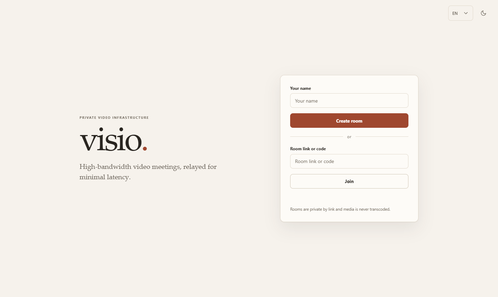
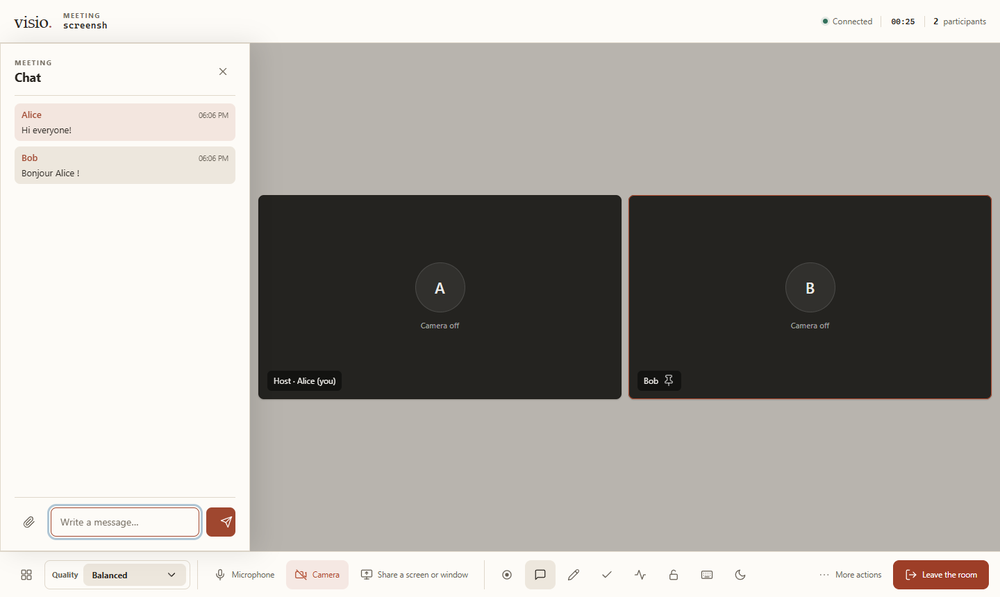
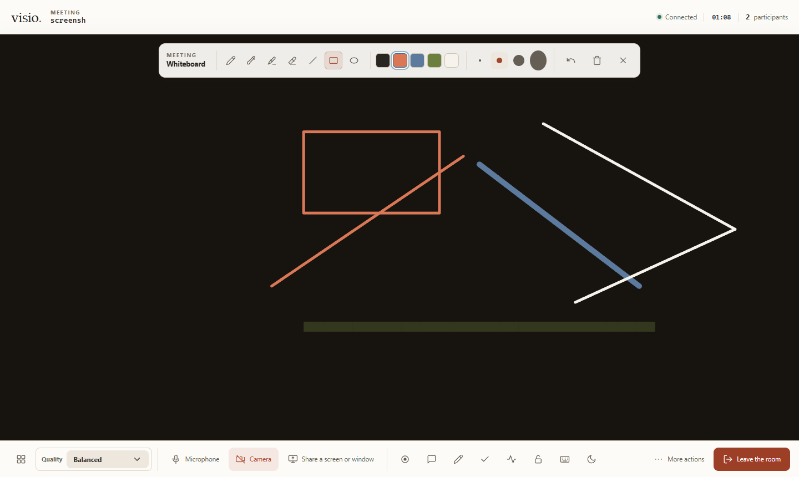
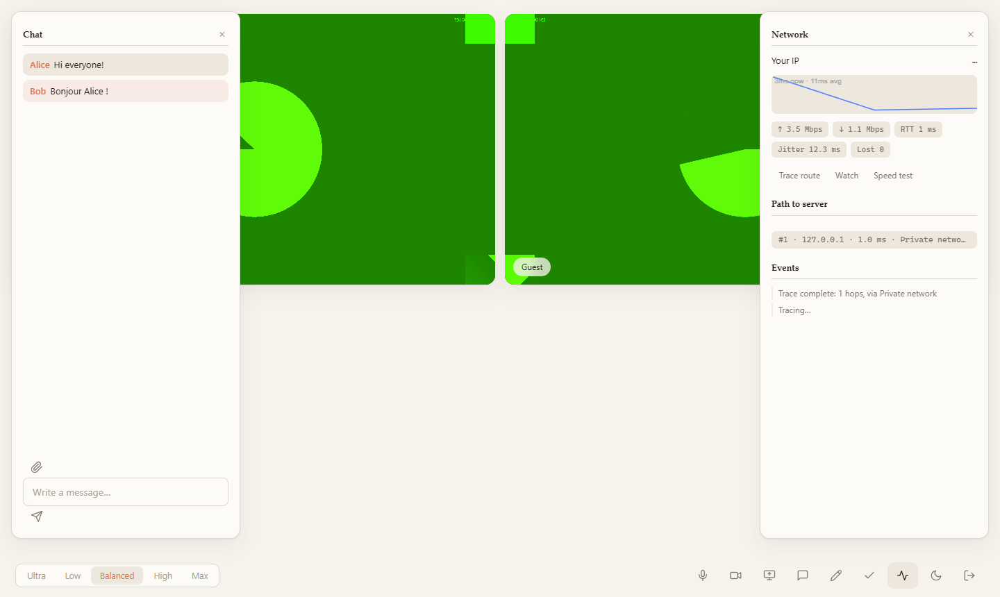
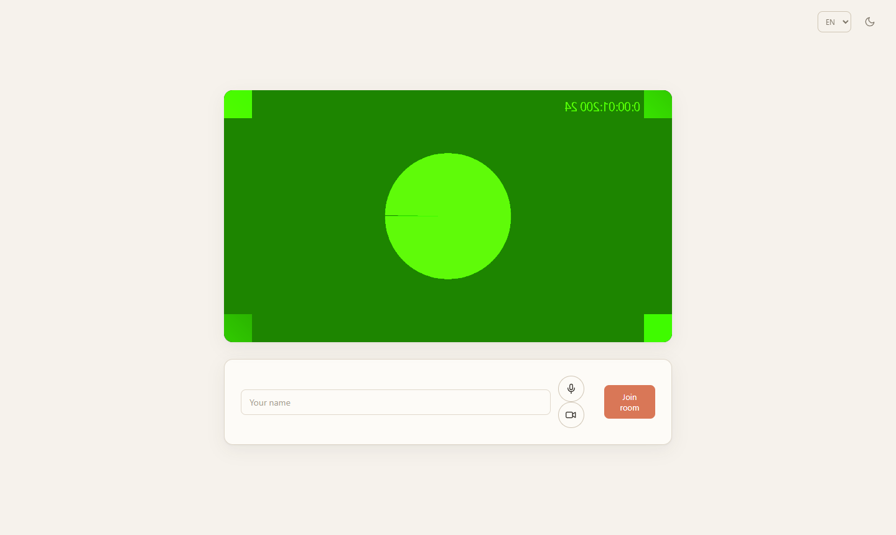
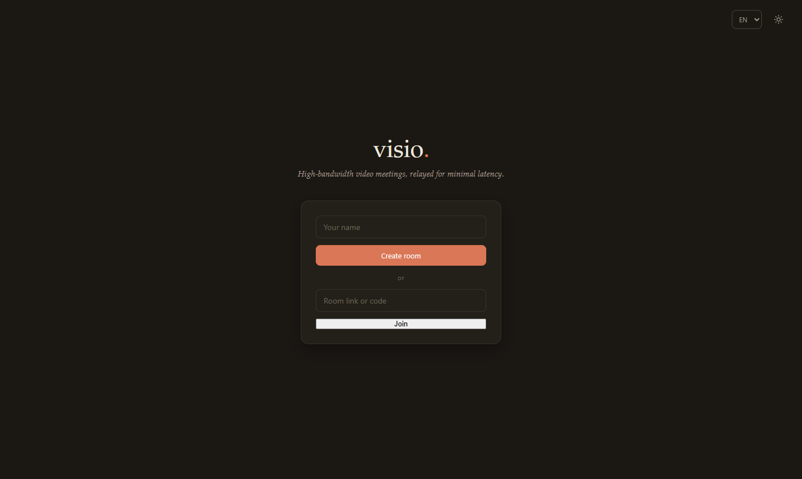
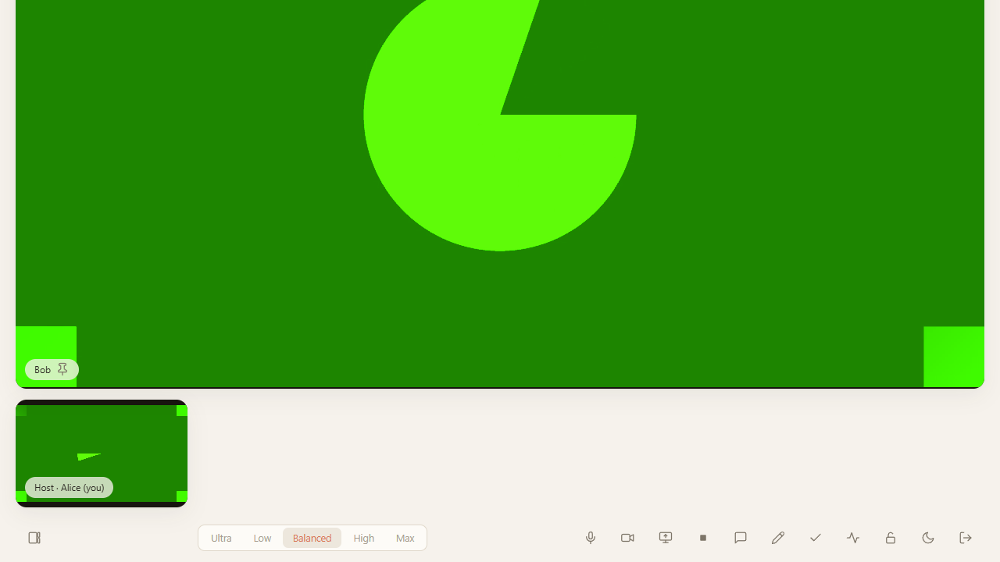

# visio

High-bandwidth video meetings relayed through your own server for minimal
latency. WebRTC media flows through a [mediasoup](https://mediasoup.org) SFU
with no transcoding — the server adds only forwarding delay, so quality scales
with the bandwidth you give it (designed for gigabit links and long routes
like Nice–Osaka).

**English · Français · 日本語**

## Features

- Multi-party rooms via unguessable links (~128-bit tokens, no passwords)
- Camera & microphone with 3-layer simulcast, up to 12 Mbps per camera
- **Multiple simultaneous screen shares**, each up to 30 Mbps at 60 fps
- Five quality/latency modes (Ultra → Max), switched live per participant
- **Chat with ephemeral file sharing** over WebRTC data channels (files are
  never stored on the server)
- **Live collaborative whiteboard** with join-time snapshot replay
- Network diagnostics panel: traceroute from the server to you with ASN /
  organization / country enrichment, route-change detection, RTT graphs,
  WebRTC stats and a download speed test
- Adaptive jitter buffers, FEC and congestion control tuned per mode
- Native desktop app for Windows & macOS ([Tauri v2](https://v2.tauri.app))

## Screenshots

| | |
|---|---|
|  |  |
| *Home — create or join with a link* | *Live room — two participants, chat, quality modes* |
|  |  |
| *Collaborative whiteboard* | *Network panel — RTT, throughput, traceroute* |
|  |  |
| *Pre-join device check* | *Dark theme* |
|  | |
| *Speaker layout — pin a participant* | |

See [FEATURES.md](docs/FEATURES.md) for a full page-by-page inventory, and
[ROADMAP.md](docs/ROADMAP.md) for planned enhancements.

## Structure

| Path | What |
|---|---|
| `shared/` | Signaling protocol types, mode profiles, whiteboard ops |
| `server/` | mediasoup SFU, WebSocket signaling, traceroute agent |
| `web/` | Browser client (Vite + TypeScript, no framework) |
| `desktop/` | Tauri desktop shell |
| `docs/` | Feature inventory, roadmap |

## Development

Requires Node 22+ and npm; the desktop app additionally needs Rust.

```bash
npm install
npm test              # 93 unit tests
npm run typecheck     # strict TS across all workspaces

npm run dev:server    # SFU + signaling on :9090
npm run dev:web       # web client on :5173 (proxies /ws and /api)
```

Open http://localhost:5173, create a room, share the link.

Desktop app:

```bash
npm run dev:desktop   # tauri dev
npm run build:desktop # .msi / .dmg bundles
```

## Deployment

See [DEPLOY.md](DEPLOY.md). Short version:

```bash
cp .env.example .env   # set ANNOUNCED_IP and SITE_ADDRESS
docker compose up -d --build
```

Caddy obtains and renews TLS certificates automatically. Camera/microphone
access requires HTTPS (or localhost).

## Privacy & security

Rooms are protected by link secrecy only — anyone holding the link can join,
so treat links like passwords. The server necessarily sees participants' IPs
and uses them for the optional traceroute panel; results are visible only to
the traced participant. Chat files travel peer-to-peer through the SFU's data
channels and are never persisted. See [SECURITY.md](SECURITY.md).

## Operating limits (defaults)

| Limit | Value | Env override |
|---|---|---|
| Rooms | 200 | `MAX_ROOMS` |
| Peers per room | 24 | `MAX_PEERS_PER_ROOM` |
| Signaling messages | 60/s per connection | — |
| Whiteboard history | 1500 ops per room | — |
| Speed test | once / 30 s per IP, ≤ 256 MB | `SPEEDTEST_COOLDOWN_MS` |

## License

[MIT](LICENSE)

